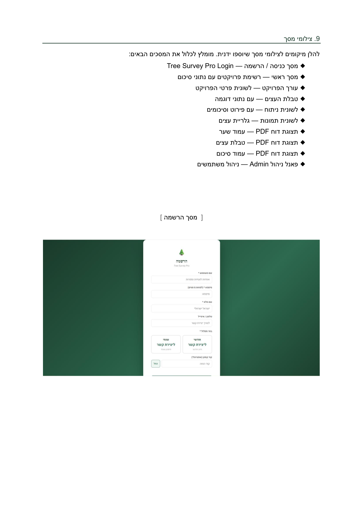
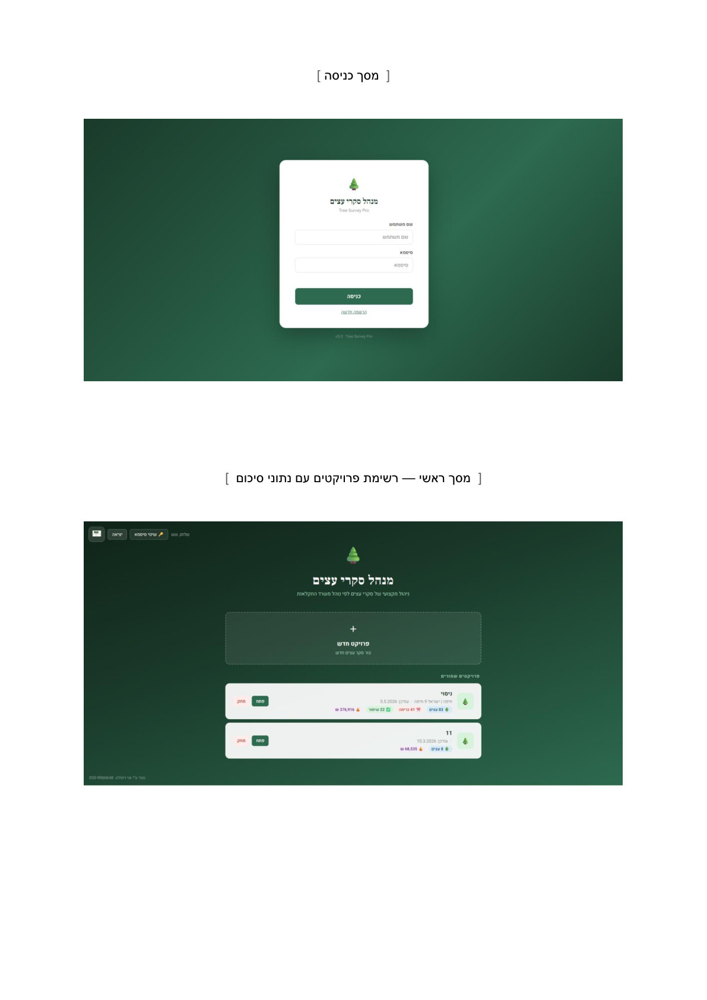
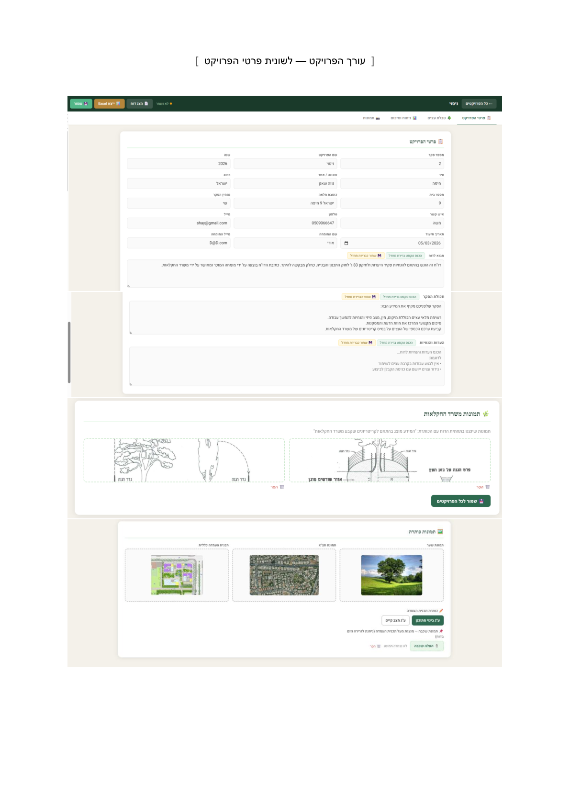
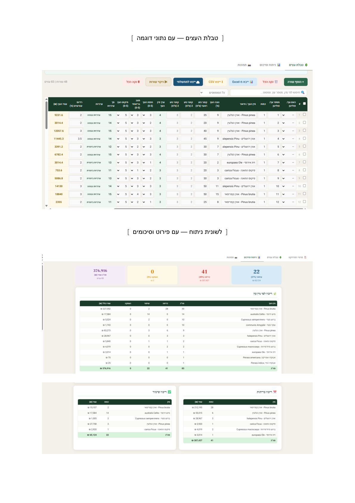
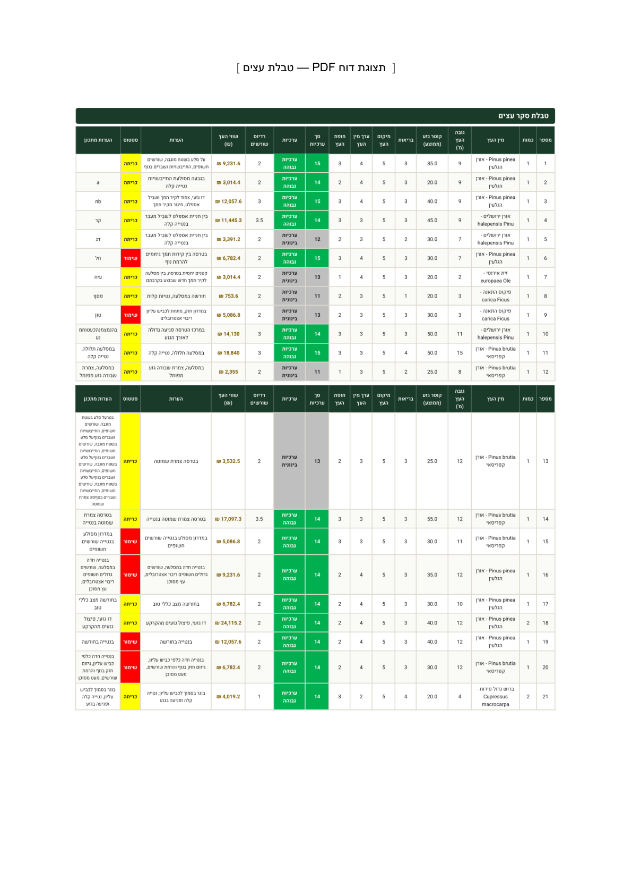
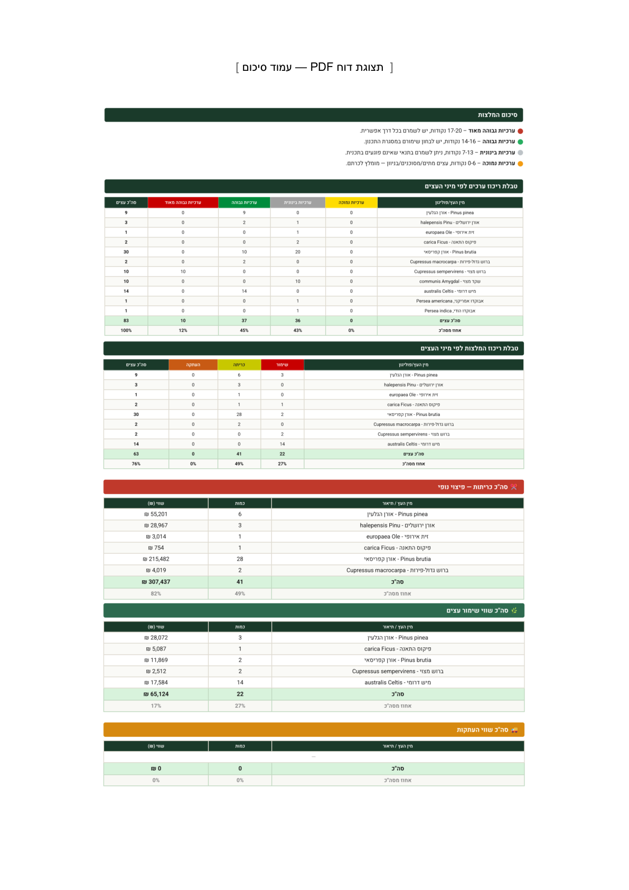
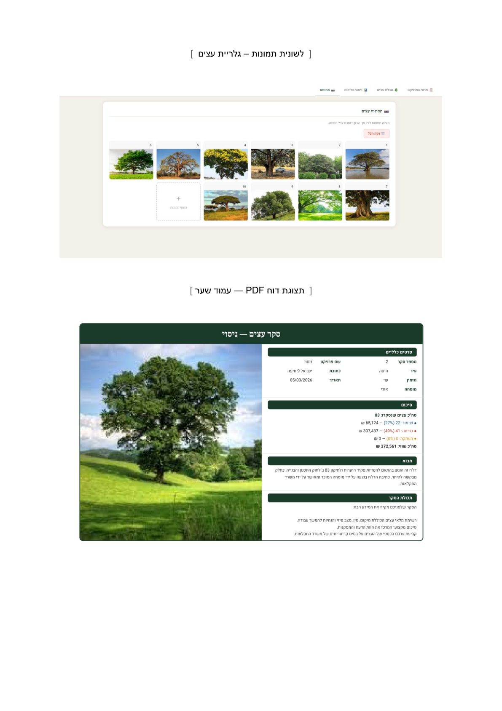
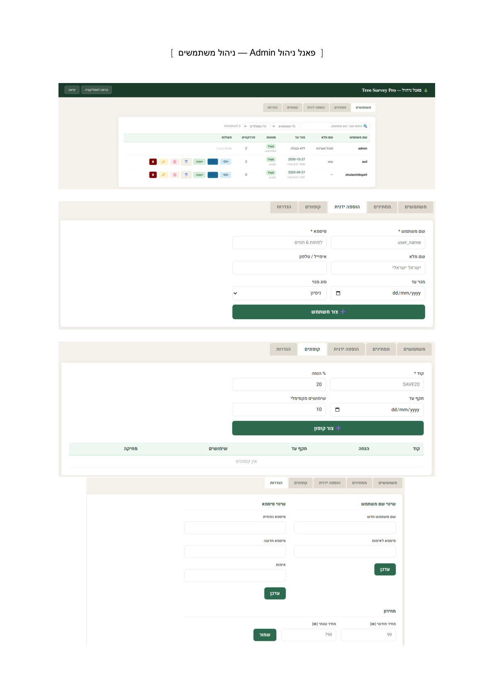

# 🌳 Tree Survey Pro — מנהל סקרי עצים

**Professional SaaS web application for tree surveys in Israel — compliant with Ministry of Agriculture regulations (2024 pricing standards)**

> Built by **Shay Doplet** | Full-stack solo project | Vanilla JS · Supabase · IndexedDB

---

## 📺 Demo Video

<video src="video/demo.mp4" controls width="100%"></video>

---

## 📸 Screenshots

| Login Screen | Project Dashboard | Project Editor |
|---|---|---|
|  |  |  |

| Tree Table (21 columns) | PDF Report — Tree Table | PDF Summary Tables |
|---|---|---|
|  |  |  |

| Photos Gallery + PDF Cover | Full Report Preview |
|---|---|
|  |  |

---

## Overview

Tree Survey Pro replaces the manual workflow (Word + Excel spreadsheets) used by Israeli arborists today with a complete digital platform. Every tree survey in Israel must comply with Ministry of Agriculture regulations and include an economic valuation of each tree — this software automates the entire process.

**The problem it solves:**
- Eliminates error-prone manual Excel calculations
- Generates a submission-ready professional report in one click — saving **2–4 hours per survey**
- Automatically calculates tree values using the official Ministry of Agriculture formula
- Manages all projects in one place

---

## Key Features

### 📁 Multi-Project Management
- Unlimited survey projects with full metadata (city, address, client, expert details)
- Auto-sorted by last activity with instant summary cards
- Per-project dashboard: total trees, removals, preservations, total value

### 🌲 Comprehensive Tree Table (21 columns)
- Tree number, polygon support (tree groups with count field)
- Species with Hebrew + Latin autocomplete (600+ species database)
- Height, trunk diameters (primary + secondary + third), crown radius
- Species coefficient (K), canopy score (0–5), health (0–5), location (0–5)
- Cumulative value, economic value (₪) — **calculated automatically**
- Status: Removal / Preservation / Relocation / No permit required
- General notes + planner notes

### 🧮 Automatic Tree Valuation — Ministry of Agriculture Formula
```
V = k_species × Σ(diameter²) × (health/5) × (location/5) × count
```
- 600+ species with calibrated k-values (2024 Ministry of Agriculture rates)
- Unknown species calculated by species score (1–5)
- Cumulative value breakdown: preserved / removed / relocated

### 📄 Professional PDF Report Generation
- Cover page: logo, project name, expert details, cover photo
- Aerial photo + site plan with draggable/zoomable overlay layer
- Full tree table — A4 landscape, print-ready
- Summary tables by species: counts, statuses, economic values
- Photo gallery (5 per row) with per-photo captions
- Ministry of Agriculture reference images
- Company logo + motto on every page

### 📊 Statistical Analysis Tab
- Data grouped by species: count, valuation score, economic value
- Status breakdown: preservation / removal / relocation / no permit
- Summary cards: total trees, removals, preservations, total value
- Value concentration table per species (for landscape compensation)

### 📷 Image Management
- Per-tree photo gallery with custom captions
- Cover photo, aerial photo, site plan — with overlay support
- Ministry of Agriculture reference images shared across projects
- Company logo applied to every report page

### 📤 Data Export / Import
- Excel export (.xlsx) — full format for internal use
- CSV export — for sharing with other systems
- CSV / Excel import — migrate existing data

### 🖥️ Advanced UX
- Bulk edit — select multiple trees, update status/health/location at once
- Search and filter by species, status, tree number
- Flexible row deletion: single, range, or from a point
- City and street name autocomplete
- Auto-save with visual indicator
- Column sorting
- Default text templates for report sections — saved per project for reuse

---

## User & Subscription System

### Authentication
- Registration screen with plan selection (monthly / yearly)
- Coupon code field for discounts
- Registration requests sent for owner approval — no auto-access
- In-app password change

### Admin Panel
- **Users tab** — view all users, filter by status/plan, search
- **Pending tab** — approve/reject new registrations
- **Manual add tab** — create accounts directly
- User management: activate, block, extend subscription, delete
- **Coupons** — create discount codes with %, expiry, usage limits
- **Pricing settings** — set monthly and yearly prices from the panel
- **Supabase integration** — receive new registrations in real time

### Subscription Plans
| Plan | Description |
|------|-------------|
| Trial | Time-limited access |
| Monthly | Recurring monthly billing |
| Yearly | One-time annual payment (discounted) |
| Unlimited | VIP / permanent business license |

---

## Technical Stack

| Layer | Technology |
|-------|-----------|
| Frontend | Vanilla JavaScript (ES2020), HTML5, CSS3 — zero framework |
| Cloud DB | Supabase (PostgreSQL via REST API) |
| Local storage | localStorage + IndexedDB (photos) |
| Local file save | File System Access API (Chrome/Edge) |
| PDF export | html2pdf.js |
| Excel export | SheetJS (xlsx) |
| Auth | SHA-256 password hashing via Web Crypto API |
| UI | RTL Hebrew, responsive, print-optimized (A4 landscape) |

### Architecture
Multi-module Vanilla JS with shared global scope — no bundler, no build step:
```
js/
├── data/
│   ├── SpeciesData.js      # 600+ species DB, k-values, global state
│   └── GovTemplate.js      # Ministry of Agriculture Excel template (Base64)
└── managers/
    ├── StorageManager.js   # localStorage + IndexedDB + Supabase layer
    ├── AuthManager.js      # Login, register, sessions, admin auth
    ├── ProjectManager.js   # Project CRUD, home screen
    ├── TreeManager.js      # Tree rows, undo/redo, Excel export
    ├── ImageManager.js     # Photo gallery, overlay viewer
    ├── ReportManager.js    # Analysis, PDF generation
    ├── BackupManager.js    # Auto-save to local folder
    ├── AdminManager.js     # Full admin panel
    └── UIController.js     # Autocomplete, modals, shared UI
```

### Security
- All survey data stored locally — no external server for project data
- SHA-256 hashed passwords
- Supabase Row Level Security for subscriber data
- RSA license system planned for Desktop version

---

## Roadmap

- [ ] **Desktop app** (Electron) — standalone window, taskbar icon, RSA license protection
- [ ] **Mobile app** — field data entry, direct camera capture per tree, sync with desktop
- [ ] Cloud backup for survey data (Supabase / Firebase)
- [ ] GIS / map integration
- [ ] Direct API submission to municipal authorities
- [ ] AI species identification from photos
- [ ] City-level tree management dashboard for municipalities

---

## Market

- **Direct users:** Arborists, landscape architects, environmental consultants, large landscaping contractors, municipalities
- **Secondary:** Construction companies, legal consultants (green litigation), planning firms
- **Market size:** Hundreds of licensed arborists in Israel; tens of thousands of tree surveys annually (construction, planning, demolition)
- **Regulatory demand:** Tree survey submission is required by law — stable, non-cyclical market
- **Competition:** No known direct competitor with a dedicated Hebrew solution for this niche

---

## Business Model

- **SaaS recurring revenue** — monthly and yearly subscriptions
- **Low operating costs** — no complex cloud infrastructure for core data
- **Low churn** — tool embedded in daily workflow is hard to abandon
- **Scalable** — adding users has near-zero marginal cost
- **Flexible pricing** — owner controls prices, discounts, and VIP accounts from the admin panel

**ROI for users:** Current workflow (Word + Excel) takes 3–6 hours per survey. This software reduces report preparation to 30–60 minutes — immediate, clear ROI justifies subscription.

---

## Contact

**Shay Doplet**  
📞 050-9066648  
📧 dopletshay1@gmail.com

---

*This repository is a portfolio showcase. Source code is proprietary.*
